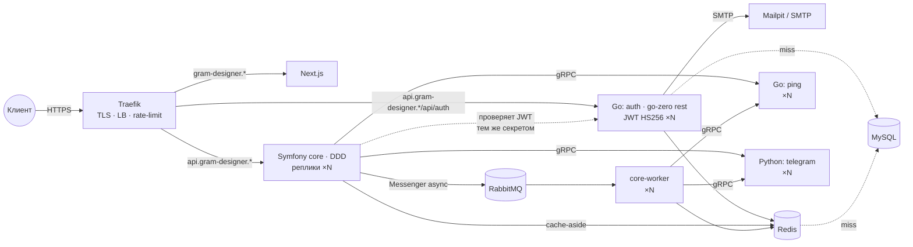

# Gram Designer

Редактор макетов с автоотправкой в Telegram. Кодовое имя репозиториев и внутренних идентификаторов — `desigram` (см. «Имя проекта и домен»).

```bash
git clone --recurse-submodules git@github.com:snowaa-desigram/desigram.git
```

## Архитектура



- **Traefik** — единственная точка входа. TLS (локально mkcert, в проде Let's Encrypt), балансировка между репликами, rate-limit на API, healthcheck.
- **Auth** (`backend/services/go/cmd/auth`) — единственный микросервис, который торчит наружу: `api.<domain>/api/auth/*` (Traefik, правило длиннее core-вского → приоритет). Регистрация/вход по email+password, коды подтверждения на почту (регистрация, сброс пароля), access-JWT (HS256, 15 мин) + refresh (opaque, 30 дней, ротация). Контракт — **OpenAPI** `backend/openapi/auth.yaml`, из него генерятся Go-типы (`make openapi`) и типы для фронта. Хранилище — GORM в общей MySQL (таблицы `auth_*`, миграции — одноразовый `auth-migrate`), пользователи читаются через Redis-кеш, коды/счётчики — Redis с TTL. Core проверяет тот же JWT (`JWT_SECRET`) и отдаёт `GET /api/me`.
- **Symfony core** (`backend/core`) — публичный API (всё, кроме `/api/auth/*`) и «оркестратор». DDD: `src/<Context>/{Domain,Application,Infrastructure,Presentation}` + `src/Shared`. Stateless (без сессий, кеш в Redis) → масштабируется репликами.
- **Redis** — только кеш. **В SQL ходим только через Redis**: Doctrine query/result/second-level cache живут в Redis во всех окружениях, репозитории наследуют `Shared/Infrastructure/Persistence/Doctrine/CachedRepository` (`remember()` — чтение через кеш, `save()/forget()` — запись + инвалидация, `cachedQuery()` — выборки с result cache). MySQL видит только промахи кеша и записи.
- **RabbitMQ** — очередь. Тяжёлые команды (например `SendPhotoCommand`) уходят в `async`-транспорт Messenger (AMQP), HTTP отвечает `202`, выполняет `core-worker`; retry ×3, упавшие — в `failed`.
- **Микросервисы** (`backend/services/*`) — внутренние, только gRPC (исключение — auth, см. выше).
  - Go: один модуль, бинарник на сервис (`cmd/<name>/main.go` + `etc/<name>.yaml`), слои `internal/<name>/{transport,service,store,adapter}` (см. «Архитектура кода»), тесты — отдельно в `tests/<name>/`. Каркас — [go-zero](https://go-zero.dev): `zrpc` для gRPC-сервисов, `rest` для auth (HTTP + JWT-middleware). zrpc: конфиг из YAML с `${ENV}`, логирование, health, Prometheus (`:9091/metrics`), OpenTelemetry-трейсы (в dev — в Jaeger), graceful shutdown; в `Mode: dev|test` включён gRPC reflection.
  - Python: uv-workspace `services/python/` — общий пакет `desigram-common` (`serve()`: health, reflection, логи, graceful shutdown, `Settings` из env) + сервисы (`telegram`).
- **Контракты**: gRPC — `backend/proto` (генерация `buf` локальными плагинами, образ `enviropment/buf`); HTTP — `backend/openapi/*.yaml` (`common.yaml` — общая схема `Error`, `auth.yaml` — auth; Go-типы через `oapi-codegen`, фронт — `openapi-typescript`). Контракт — единственный источник правды для всех языков; код из него генерируется и коммитится, CI проверяет, что он не отстал.
- **Frontend** (Next.js) — отдельный контейнер за Traefik. Из браузера ходит на `api.<domain>` (CORS в core через `nelmio/cors-bundle`, origin = `https://<domain>`), из SSR — напрямую в `http://core:8080` (`API_URL_INTERNAL`).

### Поток запроса (пример `GET /api/ping`)

```
Presentation (PingController)
  → QueryBus (Messenger, query.bus)
    → Application (PingHandler) → порт PingGateway (интерфейс)
      → Infrastructure (GrpcPingGateway) → gRPC → Go ping
```

Слои проверяет `deptrac` (`Domain ← Application ← Infrastructure/Presentation`), типы — `phpstan` (level 8), стиль — `php-cs-fixer`.

### Ядро core: четыре правила (ADR)

| Правило | Где | Как проверяется |
| --- | --- | --- |
| **Команды/запросы** — только через `CommandBus`/`QueryBus`; хендлер помечен `CommandHandler`/`QueryHandler` | `Shared/Application/Bus` | `_instanceof` в `services.yaml` |
| **События** — агрегат делает `record()`, `CachedRepository::save()` публикует их в `EventBus` после flush; подписчик = класс с `EventSubscriber` + `__invoke(Event)`. **Межконтекстная связь — только события**: контекст A не импортирует контекст B | `Shared/Application/Event`, `Shared/Infrastructure/Bus/MessengerEventBus` | `tests/Architecture/ContextIsolationTest` |
| **Ошибки API** — бросай наследника `ApplicationException` (`NotFound`, `ValidationFailed`, `Forbidden`, `Conflict`, `ExternalServiceUnavailable`); `ApiExceptionListener` превращает любое исключение под `/api` в `{code, message, details?}` — та же схема `Error`, что у auth (`backend/openapi/common.yaml`) | `Shared/Application/Exception`, `Shared/Presentation/Http` | `ApiExceptionListenerTest` |
| **gRPC-адаптеры** наследуют `GrpcGateway`: `$this->call(fn () => $client->Rpc($req, [], self::callOptions())->wait())` — таймаут, статус, `ExternalServiceUnavailable` в одном месте | `Shared/Infrastructure/Grpc` | `GrpcGatewayTest`; `make new-service` генерирует адаптер |

Чего в `Shared` намеренно нет: фабрик репозиториев, декораторов кеша, transactional outbox (`dispatch_after_current_bus` откладывает async-события до коммита), Event Sourcing. Появление класса с суффиксом `Factory`/`Visitor`/`Strategy` — повод для вопроса «зачем» на ревью.

## Структура

```
backend/                 # git submodule
  proto/                 # gRPC-контракты (buf)
  openapi/               # HTTP-контракты (OpenAPI 3.1): common.yaml (Error), auth.yaml
  core/                  # Symfony 7.4 LTS, PHP 8.4, FrankenPHP
  services/go/           # Go-сервисы (go-zero): cmd/<name>/{main.go,etc/<name>.yaml}, internal/<name>/{transport,service,store}, tests/<name>, gen/
  services/python/       # uv-workspace: common/ (каркас + gen/), telegram/ (<name>_service/{servicer,service,clients/})
enviropment/             # git submodule
  docker-compose.yml     # база + include: services/*.yml
  docker-compose.dev.yml # dev: volume, xdebug, порты, grafana/prometheus/jaeger
  docker-compose.prod.yml# prod: Let's Encrypt
  services/<name>.yml    # по файлу на микросервис (auth.yml — плюс auth-migrate и Traefik-роутер)
  ansible/               # ЕДИНАЯ ТОЧКА НАСТРОЙКИ + деплой
  php/ go/ python/ nextjs/ buf/  # Dockerfile'ы (buf — тулчейн генерации)
frontend/                # git submodule (Next.js)
scripts/new-service.sh   # генератор микросервиса
scripts/e2e.sh           # сквозная проверка поднятого стека
tests/load/api.js        # k6-сценарий «200 онлайн»
.github/workflows/       # e2e.yml (стек из сабмодулей), load.yml (k6)
```

## Единая точка настройки

Все параметры (домен, порты, креды MySQL/RabbitMQ, токены, число реплик, rate-limit, режим Go-сервисов, **адрес и ключи прод-сервера**) — в
`enviropment/ansible/inventory/group_vars/{all,local,prod}.yml`. Секреты — `ansible-vault` (`inventory/group_vars/prod/vault.yml`, зашифрованный
файл коммитится; пароль — `enviropment/ansible/.vault-pass`, gitignored). Из них Ansible генерирует `enviropment/.env`, который читает compose.

```bash
make configure          # group_vars -> enviropment/.env (локально)
make bootstrap          # свежий сервер: hardening + docker (один раз, от root провайдера)
make deploy             # прод: код + .env + compose up (то же делает CI при push в main)
```

### Имя проекта и домен

Три переменные в `group_vars/all.yml` (домен — в `local.yml`/`prod.yml`), больше нигде ничего менять не нужно:

| Переменная | Что задаёт | Куда доезжает |
| --- | --- | --- |
| `domain` | домен | Traefik-роутеры (`api.`, `traefik.`, `grafana.`, …, `mail.`), `PUBLIC_API_URL`, CORS в core, `SMTP_FROM`, ACME-email, `make cert`, `make load` |
| `app_name` | имя продукта для людей | тема писем auth (`APP_NAME`), `NEXT_PUBLIC_APP_NAME` во фронте |
| `project_name` | техническое имя | docker-сеть, имена образов `<project_name>/core`, папка деплоя `/opt/<project_name>`, `make new-service` |
| `metrika_id` | номер счётчика Яндекс Метрики (только `prod.yml`; пусто — счётчик не подключается) | `METRIKA_ID` → `NEXT_PUBLIC_METRIKA_ID` во фронте (build-arg, нужен ребилд образа) |

```yaml
# текущие значения
# all.yml:   project_name: gram-designer   app_name: Gram Designer
# prod.yml:  domain: gram-designer.com
# local.yml: domain: gram-designer.localhost
```

После смены любого из них: `make configure && make cert && make dev` (образы перетегируются из кеша, сеть пересоздастся; volume'ы с данными остаются).

Что не переименовывается (и не должно): GitHub-репозитории `snowaa-desigram/*`, Go-модуль `github.com/snowaa-desigram/...`, proto-пакеты `desigram.*.v1`,
PHP-namespace `Desigram\` в gen, `desigram-common` в Python, issuer JWT `desigram-auth`, креды MySQL/RabbitMQ `desigram` по умолчанию — это внутренние идентификаторы кода и инфраструктуры, пользователь их не видит.

```bash
make configure          # group_vars -> enviropment/.env (локально)
make deploy             # prod-серверы из inventory: docker + git clone + compose up
```

## Как пользоваться (локально)

Стек живёт в Docker за Traefik на **https://\*.gram-designer.localhost:8443** (80/443 заняты другим Docker). Всё, что ниже, — с нуля до работающего стека.

### 1. Что нужно на машине

- Docker Desktop, в Settings → Resources → **Memory ≥ 8 ГБ** (сборка grpc-расширения для PHP; при 16 ГБ можно ускорить, см. ниже)
- `mkcert` (`brew install mkcert`) — локальные HTTPS-сертификаты, которым доверяет браузер
- `ansible-playbook` (`brew install ansible`) — рендерит `.env` из group_vars
- `jq`, `curl` — для `make e2e`
- Go / PHP / Node — не обязательны: всё собирается в контейнерах; нужны только для запуска тестов на хосте

### 2. Первый запуск

```bash
git clone --recurse-submodules git@github.com:snowaa-desigram/desigram.git gram-designer && cd gram-designer
make configure   # group_vars -> enviropment/.env
make cert        # mkcert -install (один раз, спросит пароль) + сертификат на все хосты из .env
make dev         # сборка образов + compose up
```

Первая сборка `core` — 20–30 мин: `grpc`/`protobuf` компилируются из исходников, намеренно в 2 потока (`GRPC_BUILD_JOBS` в `php/Dockerfile`), потому что на `-j10` C++ съедает больше 8 ГБ и Docker падает с `cannot allocate memory`. Дальше слой в кеше. С 16 ГБ памяти: `docker compose -f enviropment/docker-compose.yml build --build-arg GRPC_BUILD_JOBS=6 core`.

Когда `make dev` закончился без ошибок — `make e2e`: 19 проверок по всей цепочке (core → gRPC → Go/Python → RabbitMQ → worker; auth: регистрация → код из Mailpit → токены → `/api/me` в core). Все ✔ — стек рабочий.

### 3. Где что

Для `domain: gram-designer.localhost` (дефолт `local.yml`; прод — `gram-designer.com` в `prod.yml`; сменил домен — все адреса ниже меняются вместе с ним):

| Что        | Где                                          |
| ---------- | -------------------------------------------- |
| Сайт       | https://gram-designer.localhost:8443              |
| API        | https://api.gram-designer.localhost:8443/api/ping |
| Auth       | https://api.gram-designer.localhost:8443/api/auth/* (напрямую, без Traefik: http://127.0.0.1:8090) |
| Почта (dev)| https://mail.gram-designer.localhost:8443 — Mailpit: сюда падают все письма (коды подтверждения) |
| Профайлер  | https://api.gram-designer.localhost:8443/_profiler |
| Traefik    | https://traefik.gram-designer.localhost:8443/dashboard/ — роутеры, здоровье бэкендов |
| Grafana    | https://grafana.gram-designer.localhost:8443 (admin/admin), дашборд **Auth** уже на месте |
| Prometheus | https://prometheus.gram-designer.localhost:8443   |
| Jaeger     | https://jaeger.gram-designer.localhost:8443 — трейсы core → gRPC, auth |
| RabbitMQ   | https://rabbitmq.gram-designer.localhost:8443 (desigram/desigram), AMQP 127.0.0.1:5673 |
| MySQL      | 127.0.0.1:3307 (desigram/desigram)           |
| Redis      | 127.0.0.1:6380                               |
| gRPC ping / telegram | 127.0.0.1:50051 / 50052            |

### 4. Проверить auth руками

```bash
API=https://api.gram-designer.localhost:8443/api/auth
curl -s -X POST $API/register -H 'Content-Type: application/json' -d '{"email":"me@example.com","password":"password-123"}'
# → 202; код — в https://mail.gram-designer.localhost:8443 (или: curl -s http://127.0.0.1:8025/api/v1/messages | jq)
curl -s -X POST $API/register/confirm -H 'Content-Type: application/json' -d '{"email":"me@example.com","code":"123456"}'
# → {"accessToken":"…","refreshToken":"…","expiresIn":900}
curl -s https://api.gram-designer.localhost:8443/api/me -H "Authorization: Bearer <accessToken>"
# → {"id":"…","email":"me@example.com"}   (core проверил JWT от auth)
```

### 5. Каждый день

```bash
make dev                # поднять/пересобрать (только изменившиеся слои)
make ps                 # состояние контейнеров
make logs S=auth        # логи сервиса (core, auth, frontend, telegram, ping, …)
make stop / make down   # остановить / снести контейнеры (volume'ы остаются)
make e2e                # сквозная проверка
make test               # unit/интеграционные тесты всех языков (то, что гоняет CI)
make core-console C="debug:router"
make core-lint          # cs-fixer + phpstan + deptrac
XDEBUG_MODE=debug make dev   # xdebug -> IDE на 9003
```

Код `core` и `frontend` монтируется volume'ом — правки видны сразу, пересборка не нужна. Go и Python — пересборка образа (`make dev`).

Отладка в core: web-profiler (`/_profiler`), debug-bundle (`dump()`), monolog, xdebug, maker-bundle (`bin/console make:*`).

### 6. Если что-то не так

| Симптом | Причина | Что делать |
| --- | --- | --- |
| Браузер: `ERR_CERT_AUTHORITY_INVALID` / `NET::ERR_CERT_COMMON_NAME_INVALID` на каком-то хосте | сертификат сделан раньше, чем хост появился в списке (Traefik подставляет свой default cert) | `make cert` — перевыпустит на все хосты из `.env` и перезапустит Traefik |
| `make dev`: `Bind for 0.0.0.0:<port> failed: port is already allocated` | порт занят другим Docker-проектом | поменять порт в `enviropment/docker-compose.dev.yml` (только dev-проброс, на Traefik не влияет) |
| `auth-migrate` / `core`: `Access denied for user 'desigram'` | volume MySQL создан с другими паролями — MySQL читает `MYSQL_*` только при первом старте | `docker compose … rm -sf database auth-migrate auth core core-worker && docker volume rm enviropment_database_data && make dev` (данные dev-БД теряются) |
| Сборка `core`: `cannot allocate memory` | мало памяти в Docker Desktop | поднять Memory; `GRPC_BUILD_JOBS` оставить 2 |
| `TLS handshake timeout` / `EOF` при `load metadata` | сеть до registry | повторить `make dev` — слои кешируются |
| Grafana `Exited (1)`, `Datasource provisioning error` | старый volume `grafana_data` | уже обработано (`deleteDatasources`); если повторится — `docker volume rm enviropment_grafana_data` |
| Frontend `Restarting` с `ERR_PNPM_…` | `node_modules` в контейнере разошёлся с lock'ом | `docker compose … up -d --force-recreate -V frontend` (пересоздать anonymous volume) |
| 503/504 через Traefik сразу после `make dev` | бэкенд ещё не прошёл healthcheck | подождать 10–20 с; https://traefik.gram-designer.localhost:8443/dashboard/ → Services покажет `UP` |
| `could not find a network matching network mode <старое имя>` после смены `project_name` | половина контейнеров ещё на старой сети | `docker compose … down --remove-orphans && make dev` (volume'ы остаются) |
| Полный сброс | — | `make down && docker volume rm $(docker volume ls -q \| grep ^enviropment_) && make dev` |

`docker compose …` здесь = `docker compose -f enviropment/docker-compose.yml -f enviropment/docker-compose.dev.yml`.

## Прод: от покупки сервера до деплоя

Всё, что нужно вписать, — в одном файле `enviropment/ansible/inventory/group_vars/prod.yml` плюс зашифрованный `prod/vault.yml`.

```bash
# 0. один раз на машине
make ansible-deps                                   # коллекции community.general, ansible.posix
# 1. купил VPS (Ubuntu 24.04, 4 vCPU / 8 ГБ), получил root-доступ по ключу или паролю
#    prod.yml:  prod_server_ip: <ip>   deploy_ssh_public_keys: [<твой ключ>, <ключ CI>]   domain: gram-designer.com
# 2. секреты
cd enviropment/ansible && openssl rand -base64 24 > .vault-pass
ansible-vault create inventory/group_vars/prod/vault.yml   # по образцу vault.yml.example; JWT/APP_SECRET — 32+ символа
cd ../..
# 3. DNS: A-записи @ и api → <ip> (Let's Encrypt проверит их при первом старте)
# 4. сервер с нуля
make bootstrap                                      # от root: пользователь deploy, ssh только по ключу, ufw 22/80/443,
                                                    # fail2ban, security-обновления, swap, docker + log-rotation
make deploy                                         # от deploy: git clone --recurse-submodules, .env из group_vars, compose up --build
```

`make bootstrap` при доступе по паролю: `make bootstrap ROOT_PASS=1` (спросит пароль). После bootstrap root-логин и пароли закрыты — только ключи из `deploy_ssh_public_keys`.

**CI/CD**: `.github/workflows/deploy.yml` — на каждый push в `main` (и вручную) раннер ставит ansible и выполняет тот же `site.yml`, что и `make deploy`. Секреты репозитория: `DEPLOY_SSH_KEY` (приватный ключ, чей публичный лежит в `deploy_ssh_public_keys`), `ANSIBLE_VAULT_PASSWORD`, `SUBMODULES_TOKEN`. Приватные репозитории сервер клонирует по fine-grained PAT из `vault_github_token`. Environment `production` в GitHub можно включить с обязательным approve.

Что делает `site.yml` линейно: `server` (hardening, идемпотентно — можно гонять каждый деплой) → `docker` → `app` (код → `.env` → `docker compose up -d --build`). Образы пока собираются на сервере (поэтому 8 ГБ + swap); следующий шаг — сборка в GitHub Actions и `pull` из GHCR, тогда серверу хватит 2 vCPU / 4 ГБ.

## Безопасность

По [MDN Practical security implementation guides](https://developer.mozilla.org/en-US/docs/Web/Security/Practical_implementation_guides). Заголовки — **одно место**: `enviropment/traefik/dynamic/headers.yml` (middlewares Traefik), роутеры подключают их в compose.

| MDN | Как сделано |
| --- | --- |
| TLS, редирект на HTTPS | Traefik: dev — mkcert, prod — Let's Encrypt (`certresolver=le` на core/auth/frontend); `web` → `websecure` редирект |
| HSTS | middleware `hsts` (2 года, includeSubDomains, preload) — только prod; на `*.localhost` намеренно нет |
| Clickjacking | `X-Frame-Options: DENY` + CSP `frame-ancestors 'none'` (для Telegram Mini App добавить `https://web.telegram.org`) |
| CSP | frontend: `app-csp` (`default-src 'self'`, `object-src 'none'`, `base-uri 'none'`, `form-action 'self'`, `'wasm-unsafe-eval'` + `worker-src blob:` под SQLite WASM; dev — `app-csp-dev` с `'unsafe-eval'`/`ws:` для HMR). API: `default-src 'none'`. **Долг**: `script-src 'unsafe-inline'` — заменить на nonce в Next.js `proxy.ts` |
| MIME sniffing | `X-Content-Type-Options: nosniff` |
| Referrer | `strict-origin-when-cross-origin` |
| CORS | auth — middleware `api-cors` (origin = `https://<domain>`); core — `nelmio/cors-bundle`, тот же origin из `CORS_ALLOW_ORIGIN` |
| CORP / COOP | `Cross-Origin-Resource-Policy: same-site`, `Cross-Origin-Opener-Policy: same-origin` |
| Permissions-Policy | камера, микрофон, геолокация, платежи, USB — выключены |
| Cookies | не используются: auth — Bearer JWT (15 мин) + refresh в теле; при переносе refresh в cookie — `Secure; HttpOnly; SameSite=Strict` |
| Rate limit | Traefik per-IP: core 50 r/s, auth 10 r/s; в auth — лимиты на коды и неудачные логины (Redis) |
| Секреты | ansible-vault; `JWT_SECRET` ≥ 32 байт проверяется auth на старте; в логи не пишутся |
| Контейнеры | `no-new-privileges` на всех сервисах; docker.sock у Traefik read-only; наружу проброшены только 80/443 (prod), остальное — внутренняя сеть |
| Сервер | `make bootstrap`: ssh только по ключу и только `deploy`, root закрыт, ufw (22 limit/80/443), fail2ban, unattended security upgrades, sysctl |
| Dashboards | Traefik/RabbitMQ/Grafana/Prometheus/Jaeger/Mailpit — только в `docker-compose.dev.yml`, в prod не публикуются |

Проверить: `curl -sI https://api.<domain>/health | grep -iE "strict|content-security|x-frame|nosniff|referrer|permissions|cross-origin"`; для фронта — [securityheaders.com](https://securityheaders.com) после деплоя.

## Контракты

```bash
make proto              # gRPC: генерация Go / PHP / Python из backend/proto
make proto-lint         # buf lint
make proto-breaking     # что сломалось относительно main (AGAINST=<ref>)
make openapi            # HTTP: backend/openapi/{common,auth}.yaml -> services/go/gen/openapi/{common,auth} (закоммитить)
# фронт: pnpm dlx openapi-typescript ../backend/openapi/auth.yaml -o src/shared/api/auth.d.ts
```

Новый HTTP-контракт — новый `backend/openapi/<name>.yaml`, ошибки — только `$ref: 'common.yaml#/components/schemas/Error'`; новые коды ошибок добавляются в enum в `common.yaml` (это один список для auth, core и фронта).

Проверить сервис вручную (reflection включён):

```bash
docker run --rm --network gram-designer fullstorydev/grpcurl -plaintext ping:50051 list
docker run --rm --network gram-designer fullstorydev/grpcurl -plaintext -d '{"message":"hi"}' ping:50051 desigram.ping.v1.PingService/Ping
```

## Auth

Флоу (см. `backend/openapi/auth.yaml`):

```
POST /api/auth/register {email,password}      → 202, код на почту
POST /api/auth/register/confirm {email,code}  → 200 {accessToken, refreshToken, expiresIn}
POST /api/auth/login {email,password}         → 200 токены (только с подтверждённым email)
POST /api/auth/refresh {refreshToken}         → 200 новая пара; старый refresh отзывается
POST /api/auth/logout {refreshToken}   Bearer → 204
POST /api/auth/password/forgot {email}        → 202 (всегда), код на почту
POST /api/auth/password/reset {email,code,newPassword} → 200 токены, все прошлые сессии сброшены
GET  /api/auth/me                      Bearer → 200 {id,email,createdAt}
GET  /api/me  (core)                   Bearer → 200 {id,email}
```

Ошибки — единая схема `Error` из `backend/openapi/common.yaml` (`{code, message, details?}`): общие коды (`validation`, `unauthorized`, `forbidden`, `not_found`, `conflict`, `too_many_requests`, `service_unavailable`, `internal`, …) и auth-специфичные (`email_taken`, `invalid_credentials`, `email_not_verified`, `invalid_code`, `code_expired`, `invalid_token`, `too_many_attempts`). Core отдаёт ошибки в этом же формате (`ApiExceptionListener`).
Защита от перебора: код — 6 цифр, 10 мин, 5 попыток, повтор не чаще раза в минуту; логин — 10 неудач на email за 15 мин → 429; Traefik `auth-ratelimit` (`auth_rate_limit`).

`JWT_SECRET` (group_vars `jwt_secret`, prod — vault) общий для auth и core, **не короче 32 байт**. SMTP — `smtp_*` в group_vars (локально — Mailpit).

Метрики — в общий стек: Prometheus скрейпит `auth:9091` (`enviropment/prometheus/prometheus.yml`), трейсы — в Jaeger (`Telemetry` в `etc/auth.yaml`), дашборд **Auth** в Grafana ставится provisioning'ом (`enviropment/grafana/provisioning/dashboards/auth.json`): RPS, p95, 5xx, регистрации/логины/блокировки в час, отказы по причине, SMTP. Свои метрики (`internal/auth/service/metrics.go`): `auth_operations_total{op,result}` (result = `ok` | код ошибки из `common.yaml` | `internal`), `auth_operation_duration_ms{op}`, `auth_mail_total{purpose,result}`, `auth_mail_duration_ms{purpose}`; HTTP-метрики `http_server_requests_*` снимает сам go-zero.

Код сервиса — по слоям `internal/auth/`: `transport/` (HTTP: `http.go`, `routes.go`, `errors.go`) → `service/` (use-cases, `errors.go`, `token.go`, `password.go`, `metrics.go`; интерфейс `Mailer`) → `store/` (модели, интерфейсы хранилищ, `gorm.go`/`redis.go`/`memory.go`); `adapter/smtp.go` — SMTP-реализация `Mailer`; `config.go` и `cmd/auth/main.go` — только композиция. Новый HTTP-сервис — по образцу auth (генератор `make new-service` — для gRPC).

## Новый микросервис

```bash
make new-service NAME=media
```

Создаёт proto-контракт, Go-код (`cmd/media/{main.go,etc/media.yaml}`, `internal/media/{config,server}.go`), `enviropment/services/media.yml`,
подключает его в compose и Prometheus, добавляет `MEDIA_GRPC_ADDR` и `MEDIA_REPLICAS` в настройки, в core — порт `Media/Application/Port/MediaGateway`,
адаптер `Infrastructure/Grpc/GrpcMediaGateway` (на `GrpcGateway`) и фейк в `tests/Fake`, генерирует код. Остаётся описать реальные RPC.

Go-код — сразу по слоям (`internal/media/{config.go,transport/grpc.go,service/service.go}`, `tests/media/`) плюс правило depguard в `.golangci.yml`; слои проверяет `go test ./tests/architecture/...`.

Python-сервис: скопировать `services/python/telegram/` (`<name>_service/{server,settings,servicer,service,clients/}` + `tests/`), добавить в `members` корневого `pyproject.toml`,
в `[tool.importlinter]` — пакет в `root_packages` и два контракта по образцу telegram, `uv lock`, создать `enviropment/services/<name>.yml` по образцу `telegram.yml` (`args.SERVICE: <name>`).

## Архитектура кода

У каждого языка — одна фиксированная структура: папки, слои, нейминг. Полные правила со сценариями — спеки `openspec/specs/`, они же — контекст для проектирования в OpenSpec (`/opsx:propose`).

| Язык | Спека | Слои (зависимости только вниз) | Проверка |
| --- | --- | --- | --- |
| Symfony core | `architecture-core` | `Presentation/Http → Application/{Command,Query,Port,EventSubscriber} → Domain/{Model,ValueObject,Event,Repository,Exception}`; `Infrastructure/<Tech>/<Tech>*` реализует порты и репозитории | deptrac (слои), `tests/Architecture/ContextIsolationTest` (контексты), `tests/Architecture/NamingConventionTest` (папки, имена, наличие тестов) |
| Go | `architecture-go-service` | `internal/<name>/transport → service → store`, `adapter/` — внешние системы, `config.go` + `cmd/<name>/main.go` — композиция; тесты только в `tests/<name>/` | `tests/architecture/layers_test.go` (парсит импорты всех сервисов), depguard в `.golangci.yml` |
| Python | `architecture-python-service` | `<name>_service/servicer → service → clients/`; `service` — без grpc и pb, порты — `Protocol` | `import-linter` (`uv run lint-imports`, контракты в `pyproject.toml`) |

Все проверки входят в `make test` и CI сабмодуля `backend`.

**Перед кодом — проектирование** (`openspec/specs/design-process`): в `design.md` каждого change обязательна секция «Паттерны» — для новых структур паттерн из каталога GoF с обоснованием и альтернативой (или «без паттерна — почему») и размещение файлов по слоям. Каталог — скилл `gof-design-patterns`, ставится локально:

```bash
pnpm dlx skills add markpitt/claude-skills --skill gof-design-patterns   # → .agents/skills/ (в репо не идёт)
```

### Граф кода (archviz)

Связанность кода можно посмотреть, а не вычитывать из импортов: `make archviz` (стек должен быть поднят, `make dev`) строит графы и открывает их на `https://arch.<domain>` (хост входит в `make cert`):

- **core** — слои и контексты (deptrac → svg), отчёт phpmetrics: связанность классов, сложность, граф зависимостей;
- **Go** — граф пакетов модуля (goda), граф вызовов по каждому `cmd/<name>` (go-callvis, без stdlib);
- **Python** — граф модулей по каждому сервису (pydeps).

Только dev: сервисы `archviz-render` (образ `enviropment/archviz/`) и `archviz` (nginx) живут под профилем `archviz` в `docker-compose.dev.yml` и не поднимаются в `make dev`. Результат — статические svg/html в `var/archviz/` (в git не идёт); упавший генератор помечается на индексе с логом, остальные графы собираются. Новые сервисы подхватываются автоматически (`cmd/*`, `members`).

## Тесты и CI

«Сломает ли мой код что-нибудь» отвечают слои, каждый ловит свой класс поломок. Всё гоняется на PR в GitHub Actions и локально теми же командами.

| Слой | Ловит | Где | Локально |
| --- | --- | --- | --- |
| Контракты | несовместимое изменение proto; OpenAPI невалиден или Go-типы не перегенерированы; маршруты auth ≠ спека | `backend` ci → `proto` (buf lint/format/breaking против `main`), `go` (oapi-codegen diff, `tests/auth/openapi_test.go`) | `make proto-lint`, `make proto-breaking`, `make openapi` |
| Архитектура | нарушение слоёв DDD; контекст импортирует другой контекст (связь — только через события); папки/имена не по спеке; слои Go (`transport → service → store`), сервис импортирует сервис; слои Python (`servicer → service → clients`), grpc в use-cases | deptrac + `tests/Architecture/{ContextIsolationTest,NamingConventionTest}` (PHP), `tests/architecture` + depguard (Go), import-linter (Python) | `make core-lint`, `make core-test`, `go test ./tests/architecture/...`, `golangci-lint run`, `uv run lint-imports` |
| Статика | типы, стиль | phpstan 8 + cs-fixer, `go vet` + golangci-lint, ruff | `make test` |
| Unit / интеграция | логика хендлеров; HTTP → шина → хендлер с in-memory портами (gRPC подменён, кеш — array); ядро core: публикация событий из `save()`, `EventBus` → подписчик, формат ошибок `ApiExceptionListener`, `GrpcGateway`; auth: service/handler на in-memory хранилищах, ответы сверяются со схемами OpenAPI, контрактные тесты хранилищ (miniredis; GORM — на MySQL из CI, локально `AUTH_TEST_MYSQL_DSN`) | `backend` ci → `php`/`go`/`python` | `make test` |
| Окружение | compose dev/prod, Dockerfile'ы (hadolint), Ansible (syntax + lint + рендер `.env`) | `enviropment` ci | `docker compose config` |
| E2E | HTTP → core → gRPC → Go/Python → RabbitMQ → worker; auth: register → код из Mailpit → confirm → refresh → reset → logout → `GET /api/me` в core | корень, `e2e.yml` (push в `main`, вручную) | `make dev && make e2e` |
| Нагрузка | p95/p99, доля ошибок при 200 VU; пороги в скрипте — вышли за них = красный job | корень, `load.yml` (кнопка / cron) | `make load` (цель — `PUBLIC_API_URL` из `.env`) |

Тестовые подмены внешних сервисов — `core/tests/Fake/*`, подключаются в `when@test` в `config/services.yaml`: новый порт → новый фейк там же.

E2E в CI собирает образы через `docker buildx bake` с GHA-кешем: первый прогон долгий (grpc-расширение), дальше минуты. Для приватных сабмодулей нужен secret `SUBMODULES_TOKEN` (PAT с `repo`). k6 умеет слать метрики в Prometheus стека metrika — secret `K6_PROMETHEUS_RW_SERVER_URL`.

## Нагрузка

Что уже заложено и как крутить при росте:

| Уровень        | Что сделано                                                     | Ручка                                  |
| -------------- | --------------------------------------------------------------- | -------------------------------------- |
| Вход           | Traefik rate-limit per-IP, healthcheck, LB по репликам          | `core_rate_limit`, `core_rate_burst`   |
| Auth           | отдельный, более строгий rate-limit; лимиты на коды и неудачные логины в Redis | `auth_rate_limit`, `auth_rate_burst`, `service_replicas.auth` |
| API            | core stateless (без сессий, кеш в Redis)                        | `core_replicas`                        |
| БД             | SQL только через Redis: Doctrine L2/result cache + `CachedRepository`; MySQL видит промахи и записи | TTL в `doctrine.yaml` / `CachedRepository::TTL` |
| Тяжёлые задачи | Messenger async → RabbitMQ → `core-worker`, retry, failed-транспорт | `core_worker_replicas`                 |
| Микросервисы   | независимые реплики, gRPC-балансировка через DNS docker         | `service_replicas.<name>`              |
| Наблюдаемость  | Prometheus + Grafana + Jaeger (dev); дашборды — `grafana/provisioning/dashboards/*.json` (Auth) | —                                      |

Следующие ступени, когда один сервер перестанет хватать: вынести MySQL/Redis/RabbitMQ на отдельные машины
(в `.env` это просто другие хосты), и перейти с compose на Swarm/K8s — контракты, образы и
структура сервисов при этом не меняются.

## Спеки (OpenSpec)

Изменения побольше одного коммита проходят через [OpenSpec](https://github.com/Fission-AI/OpenSpec): `openspec/specs/` — текущее поведение системы по доменам, `openspec/changes/<name>/` — предложение (`proposal → specs → design → tasks`), после реализации архивируется и вливается в `specs/`.
Контекст проекта и правила артефактов — `openspec/config.yaml`; команды Claude Code — `.claude/commands/opsx/*`.

```bash
pnpm add -g @fission-ai/openspec@latest   # один раз
/opsx:propose "идея"                      # в Claude Code: proposal + specs + design + tasks
/opsx:apply                               # реализовать по tasks
/opsx:archive                             # влить дельты в openspec/specs/
openspec list && openspec validate --all  # что в работе, всё ли валидно
```

## Лицензия

MIT — см. [LICENSE](LICENSE). Все репозитории проекта (backend, env, front) под той же лицензией.
