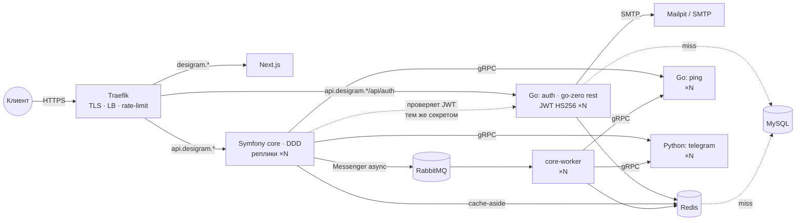

# Desigram

```bash
git clone --recurse-submodules git@github.com:snowaa-desigram/desigram.git
```

## Архитектура



- **Traefik** — единственная точка входа. TLS (локально mkcert, в проде Let's Encrypt), балансировка между репликами, rate-limit на API, healthcheck.
- **Auth** (`backend/services/go/cmd/auth`) — единственный микросервис, который торчит наружу: `api.<domain>/api/auth/*` (Traefik, правило длиннее core-вского → приоритет). Регистрация/вход по email+password, коды подтверждения на почту (регистрация, сброс пароля), access-JWT (HS256, 15 мин) + refresh (opaque, 30 дней, ротация). Контракт — **OpenAPI** `backend/openapi/auth.yaml`, из него генерятся Go-типы (`make openapi`) и типы для фронта. Хранилище — GORM в общей MySQL (таблицы `auth_*`, миграции — одноразовый `auth-migrate`), пользователи читаются через Redis-кеш, коды/счётчики — Redis с TTL. Core проверяет тот же JWT (`JWT_SECRET`) и отдаёт `GET /api/me`.
- **Symfony core** (`backend/core`) — публичный API (всё, кроме `/api/auth/*`) и «оркестратор». DDD: `src/<Context>/{Domain,Application,Infrastructure,Presentation}` + `src/Shared`. Stateless (без сессий, кеш в Redis) → масштабируется репликами.
- **Redis** — только кеш. **В SQL ходим только через Redis**: Doctrine query/result/second-level cache живут в Redis во всех окружениях, репозитории наследуют `Shared/Infrastructure/Persistence/Doctrine/CachedRepository` (`remember()` — чтение через кеш, `save()/forget()` — запись + инвалидация, `cachedQuery()` — выборки с result cache). MySQL видит только промахи кеша и записи.
- **RabbitMQ** — очередь. Тяжёлые команды (например `SendPhotoCommand`) уходят в `async`-транспорт Messenger (AMQP), HTTP отвечает `202`, выполняет `core-worker`; retry ×3, упавшие — в `failed`.
- **Микросервисы** (`backend/services/*`) — внутренние, наружу не торчат, только gRPC.
  - Go: один модуль, бинарник на сервис (`cmd/<name>/main.go` + `etc/<name>.yaml`, `internal/<name>/`), тесты — отдельно в `tests/<name>/`. Каркас — [go-zero](https://go-zero.dev): `zrpc` для gRPC-сервисов, `rest` для auth (HTTP + JWT-middleware). zrpc: конфиг из YAML с `${ENV}`, логирование, health, Prometheus (`:9091/metrics`), OpenTelemetry-трейсы (в dev — в Jaeger), graceful shutdown; в `Mode: dev|test` включён gRPC reflection.
  - Python: uv-workspace `services/python/` — общий пакет `desigram-common` (`serve()`: health, reflection, логи, graceful shutdown, `Settings` из env) + сервисы (`telegram`).
- **Контракты**: gRPC — `backend/proto` (генерация `buf` локальными плагинами, образ `enviropment/buf`); HTTP auth — `backend/openapi/auth.yaml` (Go-типы через `oapi-codegen`, фронт — `openapi-typescript`). Оба — единственный источник правды для всех языков.
- **Frontend** (Next.js) — отдельный контейнер за Traefik. Из браузера ходит на `api.<domain>` (CORS в core через `nelmio/cors-bundle`, origin = `https://<domain>`), из SSR — напрямую в `http://core:8080` (`API_URL_INTERNAL`).

### Поток запроса (пример `GET /api/ping`)

```
Presentation (PingController)
  → QueryBus (Messenger, query.bus)
    → Application (PingHandler) → порт PingGateway (интерфейс)
      → Infrastructure (GrpcPingGateway) → gRPC → Go ping
```

Слои проверяет `deptrac` (`Domain ← Application ← Infrastructure/Presentation`), типы — `phpstan` (level 8), стиль — `php-cs-fixer`.

## Структура

```
backend/                 # git submodule
  proto/                 # gRPC-контракты (buf)
  openapi/auth.yaml      # HTTP-контракт auth (OpenAPI 3.1)
  core/                  # Symfony 7.4 LTS, PHP 8.4, FrankenPHP
  services/go/           # Go-сервисы (go-zero): cmd/<name>/{main.go,etc/<name>.yaml}, internal/<name>, tests/<name>, gen/
  services/python/       # uv-workspace: common/ (каркас + gen/), telegram/
enviropment/             # git submodule
  docker-compose.yml     # база + include: services/*.yml
  docker-compose.dev.yml # dev: volume, xdebug, порты, grafana/prometheus/jaeger
  docker-compose.prod.yml# prod: Let's Encrypt
  services/<name>.yml    # по файлу на микросервис (auth.yml — плюс auth-migrate и Traefik-роутер)
  ansible/               # ЕДИНАЯ ТОЧКА НАСТРОЙКИ + деплой
  php/ go/ python/ nextjs/ buf/  # Dockerfile'ы (buf — тулчейн генерации)
frontend/                # git submodule (Next.js)
scripts/new-service.sh   # генератор микросервиса
scripts/e2e.sh           # сквозная проверка поднятого стека
tests/load/api.js        # k6-сценарий «200 онлайн»
.github/workflows/       # e2e.yml (стек из сабмодулей), load.yml (k6)
```

## Единая точка настройки

Все параметры (домен, порты, креды MySQL/RabbitMQ, токены, число реплик, rate-limit, режим Go-сервисов) — в
`enviropment/ansible/inventory/group_vars/{all,local,prod}.yml`. Секреты — `ansible-vault`
(`vault.yml.example`). Из них Ansible генерирует `enviropment/.env`, который читает compose.

```bash
make configure          # group_vars -> enviropment/.env (локально)
make deploy             # prod-серверы из inventory: docker + git clone + compose up
```

## Локально

HTTPS на порту **8443** (80/443 заняты другим Docker).

```bash
make cert DOMAINS="desigram.localhost api.desigram.localhost traefik.desigram.localhost grafana.desigram.localhost prometheus.desigram.localhost jaeger.desigram.localhost rabbitmq.desigram.localhost mail.desigram.localhost"
make dev                # = make configure + compose up --build
```

Первая сборка `core` долгая: расширения `grpc`/`protobuf` компилируются из исходников (20+ мин; `amqp`, `redis` и прочие — быстро), дальше — из кеша. Если pecl отвалился по сети — просто повторить `make dev`.

| Что        | Где                                          |
| ---------- | -------------------------------------------- |
| Сайт       | https://desigram.localhost:8443              |
| API        | https://api.desigram.localhost:8443/api/ping |
| Auth       | https://api.desigram.localhost:8443/api/auth/* (напрямую: 127.0.0.1:8081) |
| Почта (dev)| https://mail.desigram.localhost:8443 (Mailpit: сюда падают коды подтверждения) |
| Профайлер  | https://api.desigram.localhost:8443/_profiler |
| Traefik    | https://traefik.desigram.localhost:8443/dashboard/ |
| Grafana    | https://grafana.desigram.localhost:8443 (admin/admin) |
| Prometheus | https://prometheus.desigram.localhost:8443   |
| Jaeger     | https://jaeger.desigram.localhost:8443       |
| RabbitMQ   | https://rabbitmq.desigram.localhost:8443 (desigram/desigram), AMQP 127.0.0.1:5673 |
| MySQL      | 127.0.0.1:3307                               |
| Redis      | 127.0.0.1:6380                               |
| gRPC ping / telegram | 127.0.0.1:50051 / 50052            |

```bash
make logs S=core        # логи
make core-console C="debug:router"
make core-lint          # cs-fixer + phpstan + deptrac
make core-test
XDEBUG_MODE=debug make dev   # xdebug -> IDE на 9003
```

Отладка в core: web-profiler (`/_profiler`), debug-bundle (`dump()`), monolog, xdebug, maker-bundle (`bin/console make:*`).

## Контракты gRPC

```bash
make proto              # генерация Go / PHP / Python из backend/proto
make proto-lint         # buf lint
make proto-breaking     # что сломалось относительно main (AGAINST=<ref>)
```

Проверить сервис вручную (reflection включён):

```bash
docker run --rm --network desigram fullstorydev/grpcurl -plaintext ping:50051 list
docker run --rm --network desigram fullstorydev/grpcurl -plaintext -d '{"message":"hi"}' ping:50051 desigram.ping.v1.PingService/Ping
```

## Auth

Флоу (см. `backend/openapi/auth.yaml`):

```
POST /api/auth/register {email,password}      → 202, код на почту
POST /api/auth/register/confirm {email,code}  → 200 {accessToken, refreshToken, expiresIn}
POST /api/auth/login {email,password}         → 200 токены (только с подтверждённым email)
POST /api/auth/refresh {refreshToken}         → 200 новая пара; старый refresh отзывается
POST /api/auth/logout {refreshToken}   Bearer → 204
POST /api/auth/password/forgot {email}        → 202 (всегда), код на почту
POST /api/auth/password/reset {email,code,newPassword} → 200 токены, все прошлые сессии сброшены
GET  /api/auth/me                      Bearer → 200 {id,email,createdAt}
GET  /api/me  (core)                   Bearer → 200 {id,email}
```

Ошибки — единая схема `{code, message, details?}` (`validation`, `email_taken`, `invalid_credentials`, `email_not_verified`, `invalid_code`, `code_expired`, `invalid_token`, `unauthorized`, `too_many_attempts`, `too_many_requests`).
Защита от перебора: код — 6 цифр, 10 мин, 5 попыток, повтор не чаще раза в минуту; логин — 10 неудач на email за 15 мин → 429; Traefik `auth-ratelimit` (`auth_rate_limit`).

`JWT_SECRET` (group_vars `jwt_secret`, prod — vault) общий для auth и core, **не короче 32 байт**. SMTP — `smtp_*` в group_vars (локально — Mailpit).

```bash
make openapi            # backend/openapi/auth.yaml -> services/go/gen/openapi/auth (закоммитить)
# фронт: pnpm dlx openapi-typescript ../backend/openapi/auth.yaml -o src/shared/api/auth.d.ts
```

Код сервиса — линейный, без слоёв: `internal/auth/{routes,handler,service,store*,token,mailer}.go`; интерфейсы только у хранилищ и почты (ради in-memory в тестах). Новый HTTP-сервис — по образцу auth (генератор `make new-service` — для gRPC).

## Новый микросервис

```bash
make new-service NAME=media
```

Создаёт proto-контракт, Go-код (`cmd/media/{main.go,etc/media.yaml}`, `internal/media/{config,server}.go`), `enviropment/services/media.yml`,
подключает его в compose и Prometheus, добавляет `MEDIA_GRPC_ADDR` и `MEDIA_REPLICAS` в настройки, генерирует код.
Остаётся описать RPC в proto и написать порт + gRPC-адаптер в core (пример — контекст `Ping`).

Python-сервис: скопировать `services/python/telegram/`, добавить в `members` корневого `pyproject.toml`,
`uv lock`, создать `enviropment/services/<name>.yml` по образцу `telegram.yml` (`args.SERVICE: <name>`).

## Тесты и CI

«Сломает ли мой код что-нибудь» отвечают слои, каждый ловит свой класс поломок. Всё гоняется на PR в GitHub Actions и локально теми же командами.

| Слой | Ловит | Где | Локально |
| --- | --- | --- | --- |
| Контракты | несовместимое изменение proto; OpenAPI невалиден или Go-типы не перегенерированы; маршруты auth ≠ спека | `backend` ci → `proto` (buf lint/format/breaking против `main`), `go` (oapi-codegen diff, `tests/auth/openapi_test.go`) | `make proto-lint`, `make proto-breaking`, `make openapi` |
| Архитектура | нарушение слоёв DDD, запрещённые импорты | deptrac (PHP), depguard в golangci-lint (Go) | `make core-lint`, `golangci-lint run` |
| Статика | типы, стиль | phpstan 8 + cs-fixer, `go vet` + golangci-lint, ruff | `make test` |
| Unit / интеграция | логика хендлеров; HTTP → шина → хендлер с in-memory портами (gRPC подменён, кеш — array); auth: service/handler на in-memory хранилищах, ответы сверяются со схемами OpenAPI, контрактные тесты хранилищ (miniredis; GORM — на MySQL из CI, локально `AUTH_TEST_MYSQL_DSN`) | `backend` ci → `php`/`go`/`python` | `make test` |
| Окружение | compose dev/prod, Dockerfile'ы (hadolint), Ansible (syntax + lint + рендер `.env`) | `enviropment` ci | `docker compose config` |
| E2E | HTTP → core → gRPC → Go/Python → RabbitMQ → worker; auth: register → код из Mailpit → confirm → refresh → reset → logout → `GET /api/me` в core | корень, `e2e.yml` (push в `main`, вручную) | `make dev && make e2e` |
| Нагрузка | p95/p99, доля ошибок при 200 VU; пороги в скрипте — вышли за них = красный job | корень, `load.yml` (кнопка / cron) | `make load TARGET=…` |

Тестовые подмены внешних сервисов — `core/tests/Fake/*`, подключаются в `when@test` в `config/services.yaml`: новый порт → новый фейк там же.

E2E в CI собирает образы через `docker buildx bake` с GHA-кешем: первый прогон долгий (grpc-расширение), дальше минуты. Для приватных сабмодулей нужен secret `SUBMODULES_TOKEN` (PAT с `repo`). k6 умеет слать метрики в Prometheus стека metrika — secret `K6_PROMETHEUS_RW_SERVER_URL`.

## Нагрузка

Что уже заложено и как крутить при росте:

| Уровень        | Что сделано                                                     | Ручка                                  |
| -------------- | --------------------------------------------------------------- | -------------------------------------- |
| Вход           | Traefik rate-limit per-IP, healthcheck, LB по репликам          | `core_rate_limit`, `core_rate_burst`   |
| API            | core stateless (без сессий, кеш в Redis)                        | `core_replicas`                        |
| БД             | SQL только через Redis: Doctrine L2/result cache + `CachedRepository`; MySQL видит промахи и записи | TTL в `doctrine.yaml` / `CachedRepository::TTL` |
| Тяжёлые задачи | Messenger async → RabbitMQ → `core-worker`, retry, failed-транспорт | `core_worker_replicas`                 |
| Микросервисы   | независимые реплики, gRPC-балансировка через DNS docker         | `service_replicas.<name>`              |
| Наблюдаемость  | Prometheus + Grafana + Jaeger (dev)                             | —                                      |

Следующие ступени, когда один сервер перестанет хватать: вынести MySQL/Redis/RabbitMQ на отдельные машины
(в `.env` это просто другие хосты), и перейти с compose на Swarm/K8s — контракты, образы и
структура сервисов при этом не меняются.

## Лицензия

MIT — см. [LICENSE](LICENSE). Все репозитории проекта (backend, env, front) под той же лицензией.
